**SUPER POWER CLONE**
Clone made of the website superpower.com. Built 2 pages of the superpower website. Implemented the project using modern technologies and animations.
Made different sections in each page- each having its animations and frontend as required. Tried to make the clone as picture perfect as possible.
Deployed it with AWS Amplify- Deployment link- https://main.d3mcl4t2n25ylc.amplifyapp.com/ - Main Homepage,
https://main.d3mcl4t2n25ylc.amplifyapp.com/howitworkspage - How it works page

Screenshots-

**Sections**-

**Homepage**-

Hero Section - 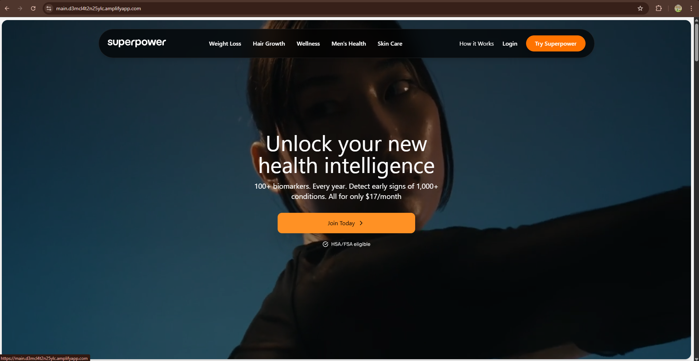
It starts with 100+ lab - 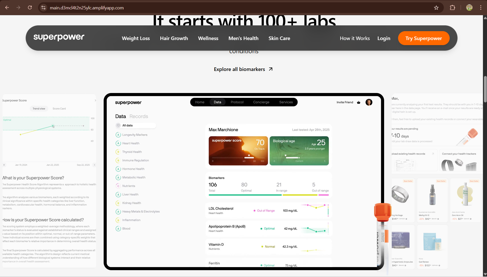
How it works(Homepage) - 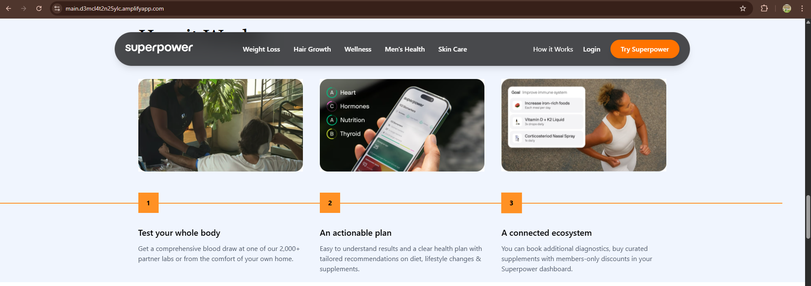
Product Section- 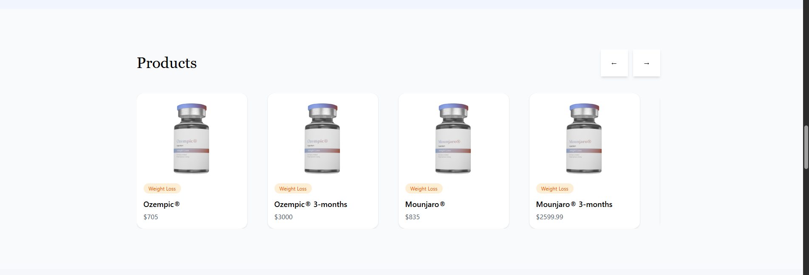

**Common Sections** -

Membership Section - 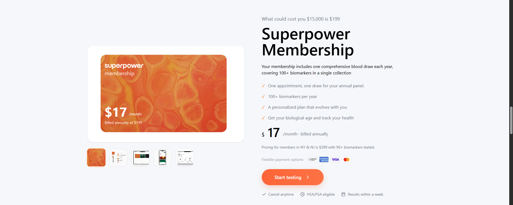
Testimonials Section - 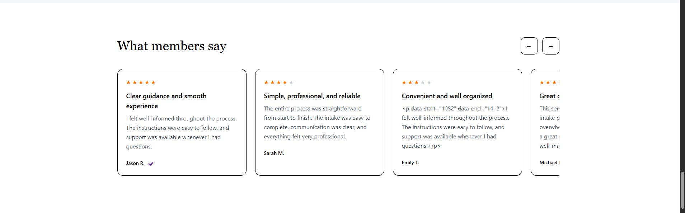
FAQ- 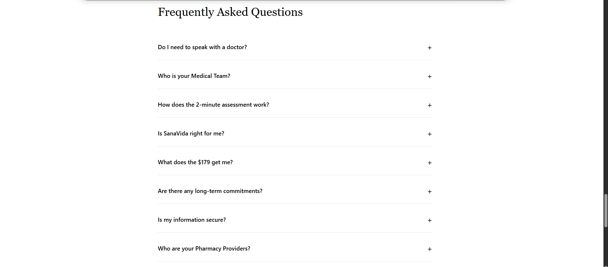 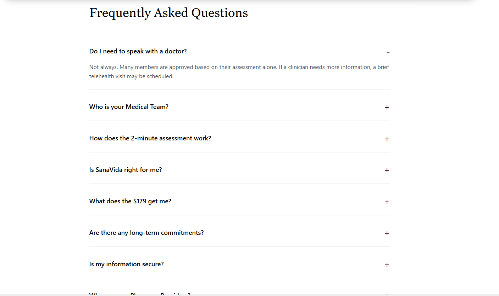
Footer- 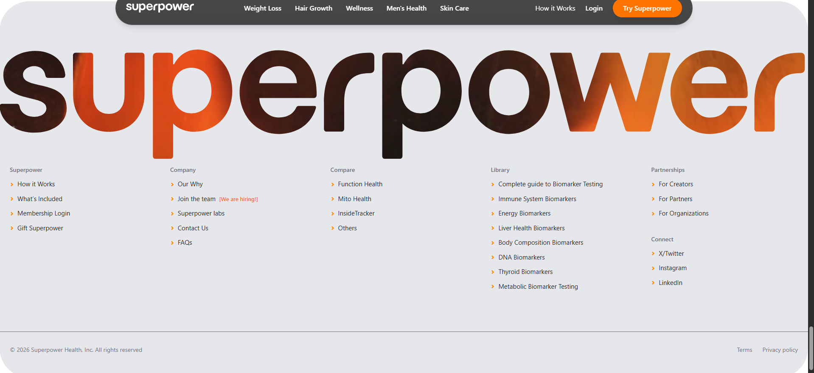

**How it Works page**-

**Hero Sec** - 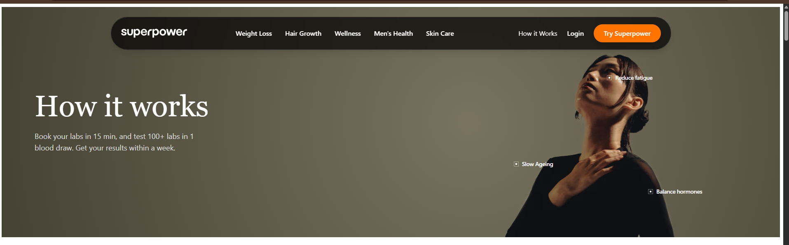
**Get Clarity** - 3 Step Animation - <video controls src="20260217-1109-02.4105272.mp4" title="Get Clarity Section Animation"></video>
**Guide Section**- <video controls src="20260217-1114-10.9483974.mp4" title="Guide Section"></video>
**Statistics Section**- 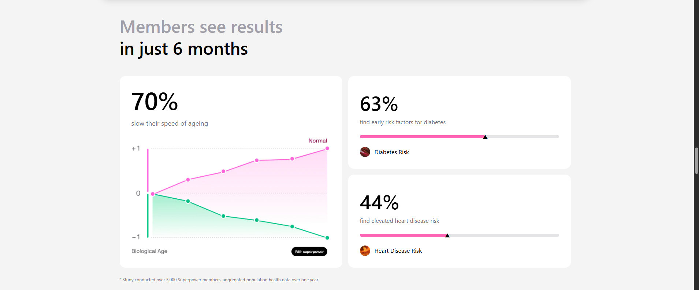
**CTA Section** - 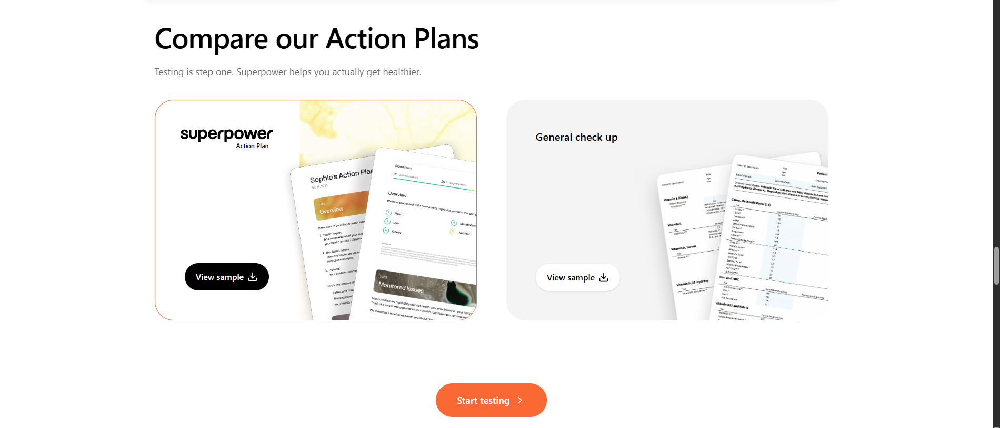

## Tech Stack

| **Technology**    | **Reasons**                                                                                            |
| ----------------- | ------------------------------------------------------------------------------------------------------ |
| **Next.js 14**    | Main framework — gives us fast page loads, file-based routing, and server components out of the box    |
| **TypeScript**    | Catches bugs before runtime — every prop, API response, and state is typed so nothing breaks silently  |
| **Tailwind CSS**  | Write styles directly in the component without switching files — keeps everything fast and consistent  |
| **Redux Toolkit** | Manages all API data globally (categories, products, testimonials, FAQ) so any component can access it |
| **GSAP**          | Handles all animations — hero entrance, scroll reveals, sliders, FAQ accordion, and page transitions   |
| **GraphQL**       | API used to fetch- Native Fetch                                                                        |
| **AWS Amplify**   | Deployment                                                                                             |

## Setup Instructions

npm, git - Required

Steps for setup-

1. Clone from the repository-
   git clone https://github.com/JeetShahTech/Super-Power-Clone.git

2. Install Dependencies- npm install

3. Create env files -
   Create '.env.local'
   Add- NEXT_PUBLIC_GRAPHQL_ENDPOINT=https://api-staging.care360-next.carevalidate.com/graphql/
   NEXT_PUBLIC_LINK_NAME=senavida

4. Start server- npm run dev

5. Open http://localhost:3000/

## Program Structure -

Main app/ - Contains the pages
app/page.tsx- Homepage
app/howitworkspage/page.tsx- How it Works page
Layout, loading and error.tsx files

components/ - Contains all the different section files and folders
Many Section have multiple files so organized them inside a folder of the section
Other components- Navbar, Footer and some single file required files

Constants/ - faqfeedback - Required for fallback as faqs if unable to fetch

Graphql- For queries

Public/ - Normal images used

Store/- Redux Store
slices/- One slice for each type of data fetch required in the project
selectors/- Selectors for reading and selecting state/data
hooks/- Typed useAppSelector and useAppDispatch hooks
provider.tsx- Wraps the app with Redux Provider
store.ts - Store config

Types/- Typescript Interfaces for the API

**Features**
Animations -  

- Header dropdown animation
- Hero text/image entrance animation
- "How it works" steps reveal on scroll
- Product Slider
- Testimonials Slider
- FAQ accordion smooth expand/collapse
- Small Card hover and button animations 
- Statistics Animations

All the sections working properly, and deployed

**API Integration**

All the data is fetched from the endpoint - https://api-staging.care360-next.carevalidate.com/graphql/
Used fetch for data fetching
Data Flow- API is called -> StoreInitializor.tsx- Fires the queries 
                            Queries- FAQ - query GetPartnerInfo($linkName: String) {
                                            organizationPartnerIntegrationPublicInfo(linkName: $linkName) {
                                            faq {
                                                id
                                                question
                                                answer
                                                index
                                                }
                                            }
                                        }

                                    Products- query GetProductBundles($linkName: String) {
                                                    organizationPartnerIntegrationPublicInfo(linkName: $linkName) {
                                                    productBundles {
                                                    id
                                                    name
                                                    price
                                                    imageUrl
                                                    tag
                                                    }
                                                }
                                            }

                                    Testimonials -  query GetOrganizationTestimonials($linkName: String) {
                                                    organizationPublicTestimonials(linkName: $linkName) {
                                                    id
                                                    rating
                                                    customerName
                                                    title
                                                    content
                                                    createdAt
                                                    isVerified
                                                }
                                            }        
 Then Slices - Store the data
 Components - Read and render data

**Git Proof**- githistory.txt File created

**Limitations/Bugs** - One line in the Get Clarity animation- running in between not able to execute 
                        Maybe some responsive issues
                        Git advanced less used

There may be many more bugs- Always up for a review and making changes

**Amplify Setup** - Followed the steps given in a demo video provided by Devang bhai earlier- Deployment was successful in the first build itself - No issues faced.

